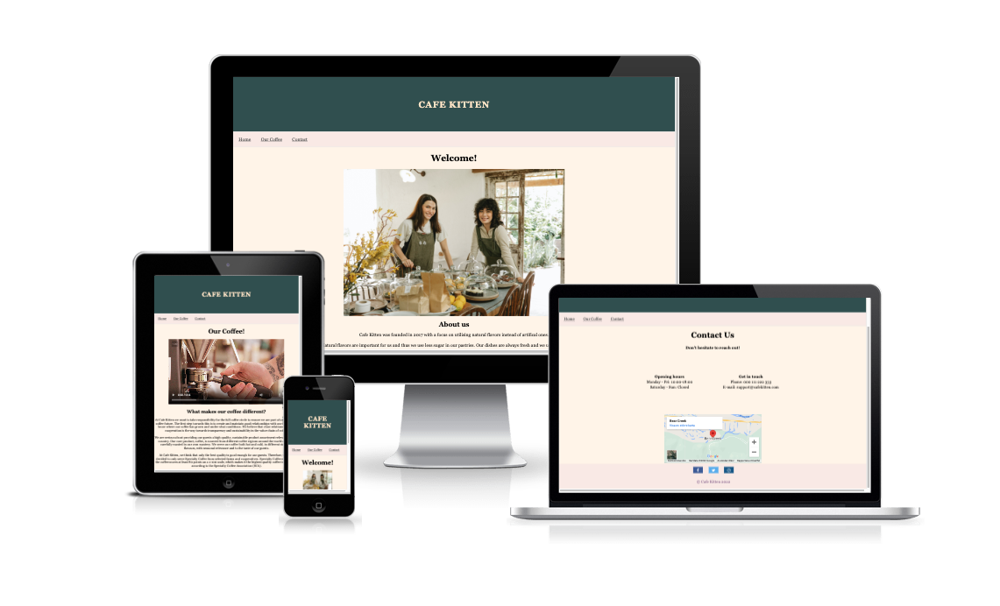
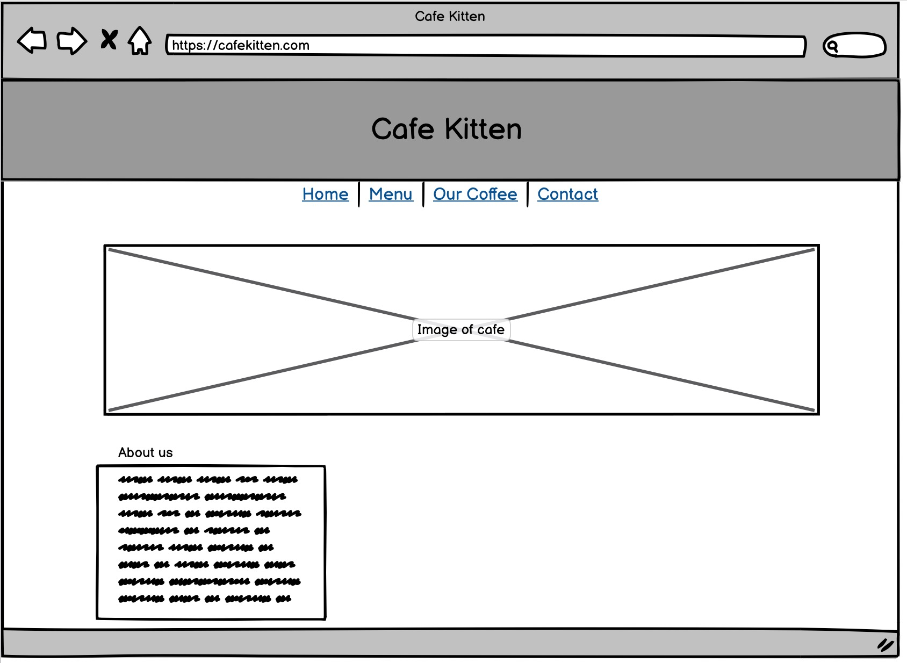
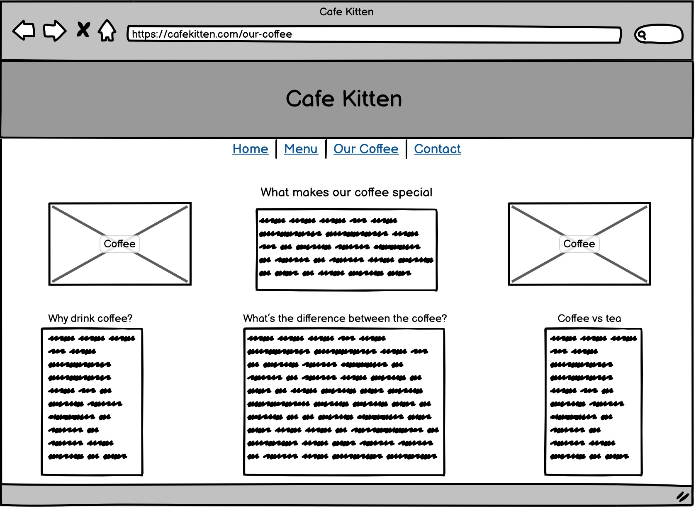
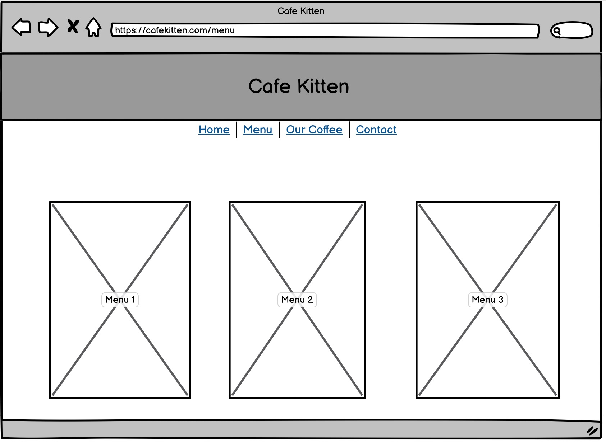
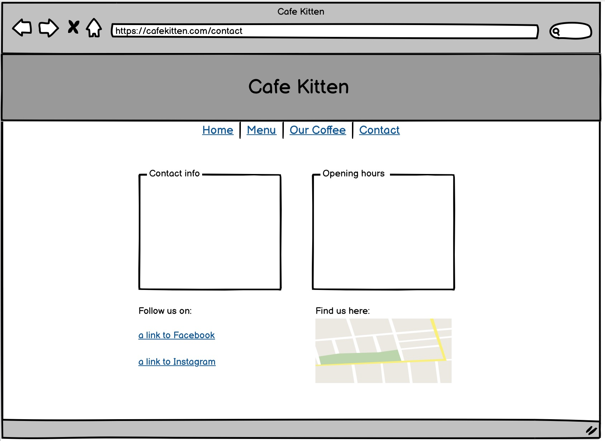

# cafekitten

The live website can be viewed [here](https://chapter256.github.io/cafekitten/).

## Introduction
The goal of this website is to use HTML and CSS to createa an info page for the user. 

## User Experience (UX)

- ### User Stories 
  1. As a user, I want to be able to find information about Cafe kitten. 
  2. As a user, I want to find out more about what makes Cafe Kitten different.
  3. As a user, I want to be able to sign up for tasting events. 
  4. As a user, I want to be able to see the menu and what items are offered. 
  5. As a user, I want to be able to find contact information to Cafe Kitten.

#### Wireframe

## Features
Cafe Kitten is a website that hopes to bring together coffee, tea and cafe lovers. Cafe Kitten is targeted towards people who love coffee, tea, lovely atmosphere and potential new taste matches.

### Navigation Bar
- A fully responsive navigation bar that uncludes links to Home, Menu, Our Coffee and Contact. 
- It's identical on all four pages to ensure that navigating will be simple and that it will be easy to go from page to page.

### Home page

The home page includes a photograph of the cafe and two of the baristas, instantly giving the customer a feel for the atmosphere at Cafe Kitten. 
There is also some information about who Cafe Kitten are and what they want to offer for their customers. 

### Our Coffee page

In the Our Coffee page there is further information about what makes Cafe kitten extra special and different. What the values are within Cafe Kitten and what Cafe Kitten is hoping to give.

### Sign up form
In the Our Coffee page a sign up form can also be found. One can choose to sign up for a coffee tasting at Cafe Kitten. The options are either Saturday or Sunday. 

### The Footer
The footer section includes links to the relevant social media sites for Cafe Kitten. The links will open to a new tab to allow easy navigation for the user.
The footer is valuable to the user as it encourages them to keep connected via social media

### Future features
Could be fun to add a little shop section with check out for pick up. 

## Technologies Used 

## Testing and Validation
HTML
No errors were returned when passing through the official W3C validator
CSS
No errors were found when passing through the official (Jigsaw) validator

### Lighthouse

### Devices

### Testing User Stories 

## Deployment

The site was deployed to GitHub pages. The steps to deploy are as follows:

- Log onto your GitHub and locate the GitHub repositor.
- Navigate to the Settings, navigate to the left to the Pages 
- From the source section drop-down menu, select the main branch
- Once the main branch has been selected, the page will be automatically refreshed with a detailed ribbon display to indicate the successful deployment.

## Credits
- I took overall help from the Love Running project from Code Institute 
- Code Institute provided a READ.me template as well that I have used 
- I used tutorials from W3schools
- Flexbox, https://css-tricks.com/snippets/css/a-guide-to-flexbox/

### Content
- The text for the Our Coffee page was taken from [Espresso House](https://tomorrowfriendly.com/planet/coffee/) information page about sustainable coffee sourcing

- The form in our coffee are from [W3school](https://www.w3schools.com/howto/howto_css_contact_form.asp) 

- The icons in the footer and code are from [W3schools](https://www.w3schools.com/howto/tryit.asp?filename=tryhow_css_social_media_buttons) 

### Media 
The images and videos used for the home and our coffee page were taken from [Pexel](www.pexel.com)
- [Home page image](https://www.pexels.com/photo/positive-women-working-in-cafeteria-in-daytime-6231611/)
- [Video of coffee beans being grinded](https://www.pexels.com/video/ground-coffee-from-a-coffee-bean-grinder-machine-2849942/)
- [Latte art video](https://www.pexels.com/video/a-person-making-a-latte-art-4932604/)
